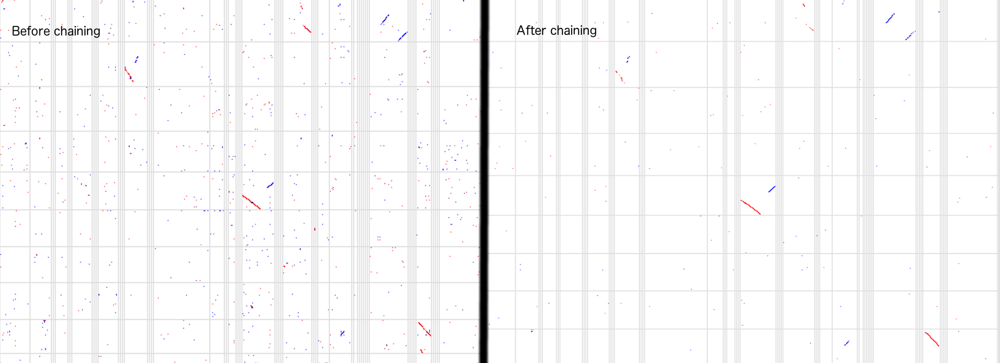

# whole_genome_alignment_pipeline


Some guidelines for whole genome alignments


## RepeatMasking

Repeat masking can be really important for whole genome alignments.

If you have a `RepeatMasker` gff file, you can softmask your genome (e.g. replace repeat regions with lower case ACGT) with `bedtools`

    bedtools maskfasta -soft -fi genome.fa -bed repeats.gff -fo genome_softmask.fa
    
If you have a `RepeatMasker` .rm.out file e.g. from NCBI Genomes FTP, you can use `BEDOPS` to convert it into a maskfasta enabled format

    rmsk2bed < repeatmasker.rm.out | cut -f1,2,3 > repeats.bed
    
Also, not used in this guide, but to create a RepeatMasked BLAST database from a FASTA file with lower-case RepeatMasking, use this


    convert2blastmask -in target.fa -parse_seqids -masking_algorithm repeat -masking_options "repeatmasker, default" -outfmt maskinfo_asn1_bin -out supercontigs_softmask.mask.asnb
    makeblastdb -in target.fa -dbtype nucl -parse_seqids -mask_data supercontigs_softmask.mask.asnb


## Whole genome alignments

### LAST

    lastdb mydb target.fa
    lastal mydb query.fa -f maf | gzip > output.maf.gz


#### Notes

* LAST claims to be able to handle repeats very flexibly and does not even require repeatmasking by some benchmarks, however if you have a RepeatMasked genome (lower case masking) then use `lastdb -c yourdb yourfile.fa` to use it.
* LAST allows multiple seeding schemes to be used. You can use lastdb -uMAM8 which has 8 seeding patterns and requires high memory, -uMAM4 has 4 seeding patterns and requires less memory for example. -uNEAR is recommended for short-and-exact matches. See http://last.cbrc.jp/doc/last-seeds.html

### LASTZ

    lastz "target.fa[multiple]" "query.fa[multiple]" --format=maf | gzip > output.maf.gz

#### Notes

* LASTZ excludes softmasked sequences from the seeding stage of the alignment process but not from later stages
* Seeds can be thought of as an alternative to an exact k-mer match, and is a pattern such as 0100100011 where the "1" are positions that match
* LASTZ allows "anchors" step to skip seeding via the --segments argument. The input is a BLASTtab-like format, but anchors must be "same length"

### MUMMER

    nucmer -p output target.fa query.fa
    delta2maf output.delta | gzip > out.maf.gz

## Post-processing

You can post process your alignments to find a syntenic net using UCSC tools

See mailing list/wiki threads about syntenic nets [1](https://groups.google.com/a/soe.ucsc.edu/forum/#!msg/genome/C7Wxn01IzQk/wHpOkr9mWAoJ) and [2](http://genomewiki.ucsc.edu/index.php/HowTo:_Syntenic_Net_or_Reciprocal_Best)


### Prepare files for UCSC tools


The netToAxt command requires 2bit format files and many steps require the "chrom.sizes" type file (two columns sequence name and length)

```
faSize -detailed query.fa > query.sizes
faSize -detailed target.fa > target.sizes
faToTwoBit query.fa query.2bit
faToTwoBit target.fa target.2bit
```

### Chaining, filtering, and netting


To get familiar with chains, nets, etc see http://cs173.stanford.edu/presentations/lecture12.pptx which I summarize below


#### What are chains?

- "Chains join together related local alignments" or more elaborately "a chain is a sequence of gapless aligned blocks, where there must be no overlaps of blocks' target or query coords within the chain."

- Before and after chaining BLASTZ raw outputs average 608 bp, after chaining 23 kb (big increase)

#### What are nets?

- "Commonly multiple mouse alignments can be found for a particular human region, particularly for coding regions -- Net finds best match <query> match for each <target> region."

- "A net is a hierarchical collection of chains, with the highest-scoring non-overlapping chains on top, and their gaps filled in where possible by lower-scoring chains, for several levels."

- "A net is single-coverage for target but not for query."


#### Procedure

As mentioned before, if your whole genome alignment can get into MAF format (or directly output PSL), you can run these steps fairly easily

Convert original genome alignment (maybe in MAF format from above) into psl, uses LAST package maf-convert

```
gunzip -c output.maf.gz | maf-convert psl | gzip > last.psl.gz
```

Run UCSC pipeline

```
gunzip -c last.psl.gz | axtChain -linearGap=loose -psl stdin target.2bit query.2bit out.pre.chain
chainPreNet out.pre.chain target.sizes query.sizes out.chain
chainNet out.chain target.sizes query.sizes target.net query.net
netSyntenic target.net target.syn.net
netFilter -syn target.syn.net > target.syn.filter.net
netToAxt target.syn.filter.net out.chain target.2bit query.2bit stdout |\
    axtSort stdin stdout |\
    axtToMaf -tPrefix=target. -qPrefix=query. stdin target.sizes query.sizes stdout |\
    gzip > out.maf.gz
```


You can also skip the netSyntenic filter

```
gunzip -c last.psl.gz | axtChain -linearGap=loose -psl stdin target.2bit query.2bit out.pre.chain
chainPreNet out.pre.chain target.sizes query.sizes out.chain
chainNet out.chain target.sizes query.sizes target.net query.net
netToAxt target.net out.chain target.2bit query.2bit stdout |\
    axtSort stdin stdout |\
    axtToMaf -tPrefix=target. -qPrefix=query. stdin target.sizes query.sizes stdout |\
    gzip > out.maf.gz
```

Note that tPrefix and qPrefix are useful as they provide an automatic prefix to chromosome/scaffold names in your outputted MAF so change them from target. and query. to the names of your organisms


## Pre-requisites

```
brew install blat kent-tools samtools last lastz mummer
```


Works with linuxbrew or OSX

If you can get your whole genome aligner to output MAF, then you can do the post-processing steps.

## delta2maf

The delta2maf package from MUMmer/Mugsy and is re-hosted in this repository in `utils/delta2maf` for convenience because it is no longer packaged in many other places

The `delta2maf` program is a binary that runs on linux systems only.

The delta2maf program is copyright of the original developers for Mugsy/Mummer and is distributed here unmodified under the Artistic License 2.0

## References

- http://rstudio-pubs-static.s3.amazonaws.com/183476_e0f3e8b454434690a45aff9dff48fdfb.html#last-aligner
- http://genomewiki.ucsc.edu/index.php/Whole_genome_alignment_howto
- http://cs173.stanford.edu/presentations/lecture12.pptx
- http://last.cbrc.jp/doc/last-seeds.html
- https://groups.google.com/a/soe.ucsc.edu/forum/#!msg/genome/C7Wxn01IzQk/wHpOkr9mWAoJ
- http://genomewiki.ucsc.edu/index.php/HowTo:_Syntenic_Net_or_Reciprocal_Best
- http://shiulab.plantbiology.msu.edu/index.php?title=SyntenicBlocks


## Notes

This is a work in progress and experimental


## Benchmarks


### Aligning two draft vertebrate genomes

* Initial output with `lastdb -c -uMAM4`: 904,703 alignments  
* After running UCSC chaining/netting/maffing: 398,590 alignments
* After running previous + synteny filter: 310,309 alignments



Figure. Screenshot of small part of draft genome alignment. For reference, image created with last-dotplot with maf files from before and after chaining as input, -x 10000 -y 10000 and the calculated bases per pixel was approx 120,000


### Aligning mouse chr1 vs human chr1

* Initial output with `lastdb -c -uMAM4`: 458,503 alignments  
* After running UCSC chaining/netting/maffing: 34,451 alignments


